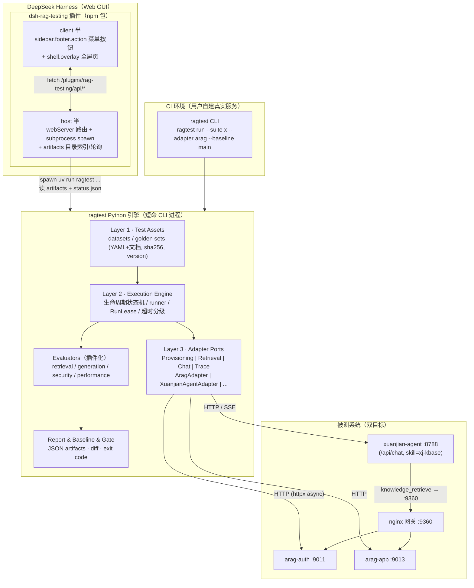

# RAG Testing Plugin Architecture Review

> 版本：v0.3（**评审通过版**——已合入 `architecture-review-audit.md` 全部 P0/P1/P2 修改与 10 项 Open Question 决策，满足 Milestone 0 准入）
> 日期：2026-08-20
> 状态：**设计冻结，可进入 Milestone 0 编码**
> 仓库：https://github.com/honggeon/rag-testing（独立版本化）
> 分析依据：
> - DSH 源码分析：`docs/dsh-architecture-analysis.md`
> - 知识库系统源码分析：zhiju-rag-knowledge（arag v0.6.5，`/Users/chen/xuanjian-code/zhiju-rag-knowledge`）
> - Agent 系统源码分析：`docs/xuanjian-agent-analysis.md`（xuanjian-agent，Starlette + hermes-agent）
> - 评审意见：`docs/architecture-review-audit.md`（v1.0，有条件通过；P0×6 / P1×7 / P2×4 已全部合入本文档）
> - 关键 API/Schema/路由均由架构师本人二次核验

---

## 0. 决策记录（原 Open Questions，已全部闭环）

| # | 问题 | 决策 |
|---|---|---|
| Q1 | 引擎语言/形态 | **Python CLI 引擎（`ragtest`）+ DSH 薄壳插件**。引擎为按需 spawn 的短命进程（非常驻服务），与 DSH 之间仅以 artifacts 目录契约为接口；CI 中无 DSH 裸跑。可选演进：`ragtest serve` 本地服务模式（不阻塞，见 §4.1） |
| Q2 | 代码归属 | 独立仓库 https://github.com/honggeon/rag-testing，独立版本化；被测仓继续演进其 `retrieval/` |
| Q3 | DSH UI 形态 | **`sidebar.footer.action` 菜单按钮 + `shell.overlay` 全屏页面**（与 dsh-agentloop「agent评测」同款，list 槽并列添加，不改 DSH 源码）。settings.section 方案弃用 |
| Q4 | arag Trace 增强 | **允许，限 observability-only**（不改业务逻辑）：R1 X-Request-Id 透传、R2 search 响应可选 trace 字段、R3 摄入阶段时间戳。规格见附录 B；adapter 全部按可选兼容，未上线时按 §10 现状工作 |
| Q5 | E2E 拓扑 | **CI 全真实服务，用户自建**。已核实 9360 = arag 仓库自带 nginx 网关（`deploy/nginx/`：`/api/v1/*`→app:9013、`/auth/*`→auth:9011）；E2E 时 agent `ZJ_KNOWLEDGE_BASE_URL` 指向 9360。MVP（M0-M3）只需 arag 半套 + embedding 服务，agent + LLM 自 M4 起需要 |
| Q6 | agent PG 只读访问 | **默认不需要**。归因主路径 = 解析 `POST /api/chat` 响应的 `session.messages`（含 tool_calls，已核验 `stream_agent.py:1457-1510`）；PG collector 为可选增强 |
| Q7 | CI 中 arag 形态 | 同 Q5：真实服务（arag 仓库 `deploy/` 拆分 compose：postgres/qdrant/rustfs/nginx + auth/engine/app + embedder） |
| Q8 | Baseline 存放 | 随 git 提交 `artifacts/baselines/`，利于 PR diff |
| Q9 | Golden 首批内容 | 先用被测仓 `test_documents/`（共聚物 pdf、十三五 docx、辛亥革命 pdf 等）做 smoke；业务真实问答对作为 M1 扩充 |
| Q10 | 疑似 bug 处理 | 提 issue + 进入独立 defect suite（`expected_fail`/`known_issue`），**不挡检索/生成质量门**。三例：`vector_similarity_weight` 被 arag 静默忽略、agent JWT 过期校验被注释、JWT_SECRET 硬编码 |

---

## 1. Current System Analysis（deepseek_harness / DSH）

### 1.1 架构事实（均有源码出处，详见 `docs/dsh-architecture-analysis.md`）

| 维度 | 事实 | 来源 |
|---|---|---|
| 插件框架 | Cordis（TS）：`ctx.plugin()` 启动插件返回 Fiber，`inject` 声明服务依赖，fiber dispose 自动回收 | `@deepseek-ai/cordis/README.md` |
| 插件治理 | Loader 条目树 `{id, name, config, group, disabled, inject}`；profile 分层 patch 组合 | `cordis-plugin-loader/README.md`、`dsh/README.md` |
| CLI | `dsh web` = `--profile web`；`dsh plugin --profile web add <pkg>` 管理 profile 插件 | `dsh/README.md` |
| 客户端插件 | package.json `dsh.client` 元数据 + `exports["./client"]`；bundle 格式 `window.__ModuleLoader__.load({id, factory})`，可手写无构建 | `dsh-client-modules/README.md`、`dsh-client-plugin-manager` |
| UI 扩展 | 无 URL 路由，slot 系统。**已核实两个第三方可用的整页级槽位**：`sidebar.footer.action`（list 型，菜单按钮，`dsh-client-ui-sidebar/.../slots.d.ts:39`）与 `shell.overlay`（list 型、root 作用域、并列添加不替换，官方注释明确 "additive seat for a frame-wide surface of your own"，`dsh-client-ui-layout/.../index.d.ts:77`）。先例：dsh-agentloop | 本机 `~/.dsh/profiles/web/node_modules/dsh-agentloop/lib/client.js:1406-1423` |
| 服务端 HTTP | `ctx.webServer.register({kind, path, handler})` 原始路由（可挂 SSE），推荐；Typert Remote 生成器未随 npm 发布，第三方受限 | `dsh-host-webserver/lib/types/index.d.ts` |
| 配置 | `ctx.settings.register(ns, schema)`，YAML 热 watch、原子写 | `dsh-settings/README.md` |
| 持久化 | `ctx.storageDomain.defineDomain(zod)` + json backend，插件可持久化自有 JSON | `dsh-storage-domain/README.md` |
| 后台任务 | `ctx.jobs` start/get/list/kill/wait | `dsh-jobs/README.md` |
| LLM 调用 | `ctx.llm.stream/prepareCall`（本方案不依赖；引擎 LLM Judge 走 OpenAI 兼容 HTTP，见 §9） | `dsh-llm/README.md` |
| 子进程 | `ctx.subprocess.spawn`（显式 argv、树级 terminate、限界缓冲）——**DSH 触发引擎的通道** | `dsh-subprocess/README.md` |
| UI 组件 | `dsh-client-ui-primitives`（PLATFORM_MODULES 共享） | 同名包 README |

### 1.2 可复用能力结论

- ✅ 插件机制、配置、JSON 持久化、后台任务、子进程、UI 组件库 —— 全部可复用，不造轮子。
- ❌ 不存在的领域能力（自建）：测试用例管理、运行编排、报告、Baseline、Quality Gate —— 全部在 Python 引擎内。
- ⚠️ 限制：host→client 事件白名单封闭（运行进度经 artifacts 目录 + host 轮询解决）；webServer 无 TLS/auth（loopback 可接受）。

### 1.3 需要修改的位置

**不修改 DSH 任何源码**。新插件 = 独立 npm 包（host 半 + client 半），`pnpm add -w` + `cordis.patch.yml` insert 注册，参照 `dsh-client-plugin-manager` / `dsh-agentloop` 范式。

---

## 2. RAG Source Analysis（被测系统）

### 2.1 arag 进程拓扑（目标 A：知识库）

| 服务 | 端口 | 职责 | 认证 |
|---|---|---|---|
| arag-auth | 9011 | 用户/角色/JWT 签发/审计/配额 | 自身签发 JWT |
| arag-engine | 9012 | 摄入管线 + 搜索 + 配额（**内部服务**） | HS256 JWT（密钥=`INTERNAL_API_KEY`） |
| arag-app | 9013 | **全部对外业务 API** + MCP + Swagger | JWT Bearer（与 auth 共享 `JWT_SECRET`） |
| nginx 网关 | **9360** | `/api/v1/*`→app、`/auth/*`→auth（`deploy/nginx/*.location`） | 透传 |

基础设施：PostgreSQL、Qdrant（gRPC 6334）、RustFS/S3、外部 OpenAI 兼容 Embedding/Rerank/LLM。
**测试平台只与 9011/9013（或经 9360 网关）交互。**

### 2.2 Authentication（arag）

- `POST /auth/v1/register` `{email, phone?, password, nickname}`；`POST /auth/v1/login` → `{token, user}`；`POST /auth/v1/token/refresh`；`GET /auth/v1/me`
- Seed 账号两个、密码环境变量两个（**评审 P2-4 已修正**）：`admin` ← `ADMIN_PASSWORD`，`ops@internal` ← `OPS_PASSWORD`（`arag-auth/src/main.rs:241-242`）。测试平台对应配置项拆分为 `RAGTEST_ARAG_ADMIN_PASSWORD` / `RAGTEST_ARAG_OPS_PASSWORD`
- 身份模型：User + Role（能力标志）。**无 Tenant/Workspace**，多租户 = 用户 × KB owner × Permission 授权表
- Admin API 完备（`/auth/v1/admin/users*` 等），测试可动态建用户

### 2.3 Knowledge Base（arag）

- `POST /api/v1/knowledge-bases` `{name, description?, kb_type: personal|team}`；`GET/PUT/DELETE .../{id}`；列表分页
- 每 KB 一个 Qdrant collection + 一个 S3 bucket
- ⚠️ KB 级**不可配置** embedding/chunk/retrieval——全部为全局环境变量（`EMBEDDER_*`、`MAX_CHUNK_SIZE=2000`、`RERANKER_ENABLED=false` 默认关、`query-expand` feature）。环境指纹必须显式声明这些（§7）

### 2.4 Document Lifecycle（arag，双层状态机）

```
业务层 DocumentStatus（arag-app，Postgres；JSON 序列化为中文）
  待上传 → 已上传 → 索引中 → 就绪 Ready / 失败 Failed；删除中 → 已删除（软删）
引擎层 JobStatus（arag-engine，SQLite 队列）
  queued → running → completed | failed | cancelled | retrying | copying
```

- 上传：`POST /api/v1/knowledge-bases/{id}/documents`（multipart）；断点续传 5 端点（支持 `client_request_id` 幂等）
- 状态：**仅轮询**。`GET .../documents/{doc_id}` → `{status, ingest_progress, error_message, chunk_count}`
- 摄入管线：extraction(Kreuzberg) → summary(LLM) → chunking(≤2000 字符) → embedding → Qdrant upsert；每阶段打 `[pipeline] stage=...` 日志
- **状态解析规则（评审 P1-7 已修正）**：API JSON 序列化为中文（"就绪"/"失败"），但 `FromStr` 兼容英文、`Display` 为英文——**adapter 映射表中英双收，契约测试锁定线上 JSON 为中文**。

### 2.5 Retrieval（arag）

- `POST /api/v1/knowledge-bases/search/text`、`POST /api/v1/knowledge-bases/{id}/search`、`POST .../search/all/text`
- 请求 `{query, top_k=5∈[1,20], score_threshold=0.0∈[0,1], kb_ids[], document_ids[]}`
- 响应 `SearchResponse{items[], degraded, degraded_reason?}`，item 含 `kb_id, document_id, chunk_id, score, embedding_model, text_content, text_chunk_index, text_first_page/last_page, text_breadcrumb, text_chunk_source, document_name, download_url`
- 引擎管线：dense（×3 候选）+ BM25（×2，`fulltext-index` feature）→ RRF → 5 层去重 → rerank（×5 候选，默认关）→ top_k；`query-expand` feature 可开查询扩展
- ✅ chunk 明细 + score 齐全；❌ 无 rerank_score、无 rank 序号（按数组序）、无 metadata filter（仅 document_ids）
- query 上限 app 1000 / engine 1024 字符（不一致，冲突 #5）

### 2.6 Generation / RAG Chat

arag 无 Chat API。生成链路在 **xuanjian-agent**（见 §2B）。被测对象为**双目标**：
- **目标 A（arag）**：检索质量/功能/权限/性能/鲁棒性，HTTP 黑盒；
- **目标 B（xuanjian-agent）**：端到端 RAG 生成质量（answer/citation/faithfulness 归因），`POST /api/chat` 可测。

### 2.7 Permission（arag）

- `Permission{user_id, kb_id, level: admin>write>read|null}`；检查点在 app handler 层（engine 不做授权）
- API：`POST/DELETE /api/v1/knowledge-bases/{kb_id}/permissions[/{user_id}]`、`GET .../permissions/users`
- ✅ 越权检索测试理想靶场

### 2.8 Observability（arag）

- ❌ 无 trace_id / OTel / TTFT / token usage（Q4 已批准 observability-only 增强，规格见附录 B，adapter 可选兼容）
- ✅ 响应体字段（degraded、ingest_progress、error_message、current_task）、tracing 日志（pipeline 阶段耗时）、auth 审计日志 API、`GET /health` / `GET /version`

### 2.9 arag 侧冲突清单（README/docs vs 代码）

| # | 文档宣称 | 代码事实 |
|---|---|---|
| 1 | `X-Internal-API-Key` header | 实际 INTERNAL_API_KEY 签发的 JWT Bearer |
| 2 | 对话功能 `/api/v1/conversations` | 未实现 |
| 3 | MCP 为 SSE 传输 | 实际 Streamable HTTP（`ANY /mcp`） |
| 4 | `deploy/docker-compose.yml` | 不存在，只有拆分 compose |
| 5 | query 上限一致 | app 1000 vs engine 1024 |
| 6 | `permissions/users/without` 语义 | 与 `permissions/users` 同一 handler（疑似笔误） |
| 7 | 文档状态英文 | JSON 序列化中文（FromStr 兼容英文） |

---

## 2B. xuanjian-agent Source Analysis（目标 B：RAG 问答链路）

> 完整报告：`docs/xuanjian-agent-analysis.md`。项目：`/Users/chen/xuanjian-code/xuanjian-agent`。

### 2B.1 拓扑与配置

- `python main.py server`，默认 **:8788**；`GET /health`
- 依赖：PostgreSQL（会话/消息）、LLM（`OPENAI_BASE_URL`/`LLM_MODEL`，或 service 模式 AI Gateway）、arag（`ZJ_KNOWLEDGE_BASE_URL`，默认 `127.0.0.1:9360` nginx 网关）、技能商店（skill 同步）

### 2B.2 Chat API（黑盒测试入口）

| Method | Path | 说明 |
|---|---|---|
| POST | `/api/chat` | **同步 JSON**：内部 start + 消费至 done，**返回 done 完整载荷（含 `session.messages`、usage、response）**（`stream_agent.py:1457-1510`，已核验）——测试与归因首选 |
| POST | `/api/chat/start` + GET `/api/chat/stream` | 流式两段式；SSE 事件 `thinking→(reasoning|token|tool|tool_complete|…)*→done→stream_end`；`tool` 事件 args 截断 120 字符 |
| GET | `/api/chat/stream/status`、`/api/chat/cancel` | 状态/取消 |
| POST | `/api/session/new`、`POST /api/session/delete` | 会话生命周期 |

请求体：`session_id`✅、`message`✅、`skill`（传 `"xj-kbase"` 改写成指令前缀强制走知识库技能，`stream_agent.py:223-232`）、`model/base_url/api_key/provider` 可覆盖、`max_turns`、`reasoning_effort`。
⚠️ kb_id 无 HTTP 字段 → **Adapter 负责注入确定性检索指令**（§6.3，评审 P0-3）。

### 2B.3 知识库工具（agent → arag）

- `system/tools/knowledge_tool.py` + `system/libs/knowledge.py` 的 `KBClient`
- 身份映射：取会话 uid，共享密钥现场签 arag JWT（`sub=uid`）——**agent uid 必须等于 arag user_id**（§6.1 IdentityBinding，评审 P0-1）
- `knowledge_retrieve` → `POST {base}/api/v1/knowledge-bases/{kb_id}/search`，body 含 `vector_similarity_weight`/`document_id`——**不在 arag schema 内，被 serde 静默忽略（疑似产品 bug，冲突 #8）**
- 工具返回 LLM：`{success, count, degraded, chunks:[arag items...]}`

### 2B.4 生成链路与 citation

LLM 按 SKILL.md 工作流自行提炼 query/拆子问题（代码侧无改写）；检索结果以 `role=tool` 消息注入；citation 仅提示词约束（`[^n]` 脚注 + 「📚 参考来源」模板），**无结构化 citation 输出** → `ChatResult` 不含 citations 字段，由 `citation_format` evaluator 从文本抽取（评审 P1-6）。

### 2B.5 Authentication（agent）

- `X-USER-ID: <uid>` 头或 `?user_id=`（黑盒测试最简方式）；或 arag 体系 JWT Bearer（**过期校验被注释**，冲突 #10）
- 多用户隔离：会话 key 含 uid；知识库工具按 uid 独立签 arag JWT

### 2B.6 Observability（agent）

- **归因主路径（评审 P0-6 已修正）**：`POST /api/chat` 响应即含 `session.messages`（assistant 行 `tool_calls` 完整入参 + tool 行完整检索返回），无需 PG
- 兜底：SSE `tool`/`tool_complete` 快照（截断 120 字符）；可选增强：PG `messages` 表只读、`SAVE_TRAJECTORIES_UIDS` 轨迹快照
- `done.usage{input_tokens, output_tokens, estimated_cost}`；日志含每次 LLM 调用 latency
- ❌ 无 trace_id、无内建 TTFT（SSE 自测补偿）

### 2B.7 agent 侧冲突清单（编号延续 §2.9，评审 P2-3 已重排）

| # | 文档/宣称 | 代码事实 |
|---|---|---|
| 8 | skill `vector_weight` 可调优 | arag `SearchKbRequest` 无此字段，被静默忽略（**疑似 bug**） |
| 9 | 知识库地址 9013/9011 | 代码/.env 为 127.0.0.1:9360（已核实 = nginx 网关） |
| 10 | JWT 有过期保护 | 过期校验被注释（`system/auth.py:83-85`） |
| 11 | 「kb_id 由平台解析传入」 | 服务端无此逻辑，靠 LLM 调 `knowledge_list` 自解析 |
| 12 | JWT_SECRET 应保密 | 硬编码于 `system/auth.py:15`，测试环境可自签任意 uid token |

---

## 3. Gap Analysis

| 测试平台所需能力 | DSH 现状 | 被测系统现状 | Gap 与对策 |
|---|---|---|---|
| 用例/Suite 定义与版本化 | ❌ | N/A | 自建：YAML golden set + schema_version |
| 执行引擎（生命周期状态机） | ❌ | N/A | 自建：Python runner（状态表见 §12） |
| Adapter 抽象 | N/A | N/A | 自建：四 Port 组合（§6.1） |
| 检索质量指标 | ❌ | ⚠️ 被测仓 `retrieval/eval/` 有 HitRate/MRR 模式可借鉴 | 自建 evaluators |
| 生成质量指标 | `ctx.llm`（不用） | ✅ agent `/api/chat` 同步端点 + skill 参数 + done.usage | XuanjianAgentAdapter + generation evaluators（M4）；LLM Judge 走 OpenAI 兼容 HTTP（M6） |
| 端到端归因（检索错 vs 生成错） | ❌ | ✅ chat 响应 `session.messages` 含 tool_calls 全量 | `TracePort.collect_agent_trace` 解析响应（PG 可选增强） |
| Trace | ❌ | ⚠️ arag 无 trace_id（Q4 增强待提）；agent 有 usage/tool 事件 | 客户端 span + 响应快照，诚实分层 |
| 报告存储与展示 | ✅ storageDomain / ui-primitives | N/A | 引擎写 artifacts；插件读目录渲染 |
| Baseline / Gate / CI exit code | ❌ | N/A | 自建（§11/§12） |
| 测试用户/权限场景 | N/A | ✅ admin API + Permission API | AragAdapter identity 管理 + IdentityBinding |
| 异步就绪等待 | ❌ | ⚠️ 仅轮询 | backoff 轮询（§6.1 PollPolicy） |
| CI 环境 | N/A | ✅ 用户自建真实服务（Q5/Q7） | 引擎仅依赖 base URL 环境变量 |

---

## 4. Architecture

### 4.1 关键架构决策：引擎形态（Q1 已拍板）

**Python CLI 引擎 + DSH 薄壳插件；引擎为按需 spawn 的短命进程，非常驻服务。**

- 引擎 100% 独立可用：`ragtest run --suite x --adapter arag --baseline main`，CI 裸容器跑，exit code 语义见 §12
- DSH 插件只做：触发（`ctx.subprocess.spawn`）、索引（扫 artifacts 目录）、渲染（React 页）
- DSH ↔ 引擎唯一契约 = **artifacts 目录协议**（§5.1，M0 即实现）
- 演进预留：未来 UI 需要实时进度/单 case 重跑时，引擎可加 `ragtest serve` 本地 HTTP 模式，插件从扫目录升级为调接口——**不影响现有设计**

否决「全 TS 内嵌」的理由：CI 不可接受（需装整个 DSH）、团队 Python 栈与 `retrieval/` 评测资产分裂、评测生态（numpy/ragas 类）在 Python。

### 4.2 总体分层



### 4.3 仓库布局（git: github.com/honggeon/rag-testing）

```
rag-testing/
├── engine/                          # Python 包 ragtest（uv 管理，requires-python >=3.11）
│   ├── pyproject.toml               # 注：3.11 为 CI 镜像友好；与被测仓 retrieval/ 对齐 3.13 是可选
│   ├── ragtest/
│   │   ├── cli.py                   # ragtest run / validate / baseline-update
│   │   ├── config.py                # pydantic-settings，env 前缀 RAGTEST_
│   │   ├── models/                  # 全部 pydantic schema（§7/§8）
│   │   ├── adapters/
│   │   │   ├── base.py              # 四 Port Protocol + 归一化类型（§6.1）
│   │   │   ├── registry.py          # 名字 → adapter class
│   │   │   ├── arag/                # AragAdapter（§6.2）
│   │   │   └── xuanjian/            # XuanjianAgentAdapter（§6.3）
│   │   ├── runner/
│   │   │   ├── lifecycle.py         # 状态机（§12 状态表）
│   │   │   ├── executor.py          # case 并发、分级超时、重试
│   │   │   ├── lease.py             # RunLease 资源清单与逆序清理
│   │   │   └── polling.py           # backoff 轮询
│   │   ├── evaluators/
│   │   │   ├── base.py              # Evaluator Protocol + 注册表
│   │   │   ├── retrieval/           # hit_rate / recall / mrr
│   │   │   ├── generation/          # M4：golden_facts / forbidden_fact / citation_format / retrieval_attribution
│   │   │   ├── security/            # forbidden_document / permission_leak
│   │   │   └── performance/         # latency
│   │   ├── assets/                  # dataset/golden 加载、sha256、版本校验
│   │   ├── report/                  # run.json + summary.md + junit.xml
│   │   ├── baseline.py              # load / diff / 回归分类 / 可比性校验
│   │   └── gate.py                  # quality gate → exit code
│   └── tests/                       # pytest：evaluators 单测 + adapter 契约测试（wiremock/vcrpy + 真实响应 fixture）
├── plugin/                          # npm 包 dsh-rag-testing（M5）
│   ├── package.json                 # dsh.bundle.patch + dsh.client
│   ├── cordis.patch.yml
│   ├── lib/index.js                 # host：webServer 路由 + spawn + 目录索引
│   └── lib/client.js                # client：sidebar.footer.action + shell.overlay
├── suites/                          # 示例资产（随引擎版本化）
│   ├── datasets/basic/{documents/*, dataset.yaml}
│   └── golden/{basic_retrieval.v1.yaml, e2e_generation.v1.yaml, defects.v1.yaml}
├── artifacts/
│   ├── runs/                        # 运行产物（gitignore）
│   └── baselines/                   # 随 git 提交（Q8）
└── docs/                            # 本文档 + 分析报告 + 评审意见
```

### 4.4 模块边界

| Module | Responsibility | Public Interface | Dependency |
|---|---|---|---|
| `ragtest.models` | 全部 Schema（含 schema_version） | pydantic 模型 | 无（叶子） |
| `ragtest.adapters.base` | 四 Port 协议 + 归一化类型 | `ProvisioningPort/RetrievalPort/ChatPort/TracePort`、`Capability` | models |
| `ragtest.adapters.arag` / `.xuanjian` | 具体系统实现 | 对应 Port 实现 + `capabilities()` | base、httpx |
| `ragtest.assets` | 资产加载、sha256、版本校验 | `load_dataset/load_suite` | models |
| `ragtest.runner` | 状态机、执行、RunLease、分级超时 | `run_suite(suite, adapters, config) -> TestRun` | adapters.base、evaluators、models |
| `ragtest.evaluators.*` | 指标计算，纯函数 | `evaluate(case, case_result, params) -> MetricResult` | models |
| `ragtest.baseline` / `.gate` / `.report` | 基线/门禁/报告 | 见 §11/§12 | models |
| `ragtest.cli` | 命令行、exit code | `run/validate/baseline-update` | 全部 |
| `dsh-rag-testing` (plugin) | UI 展示、触发、索引 | host HTTP 路由 + client React | DSH ctx、artifacts 目录 |

**依赖规则（强制）**：runner 只 import `adapters.base`；evaluator 不 import runner/adapter；plugin 不含测试逻辑。

---

## 5. Data Flow

```
suite.yaml + dataset/
 → assets.load（schema 校验 + sha256 + 版本记录）
 → runner 生命周期（状态表见 §12）：
   INIT → LOAD_SUITE → LOGIN（每 identity，含 IdentityBinding 回写）
   → CREATE_KB → UPLOAD_DOCUMENTS → WAIT_INDEX_READY（backoff，记 indexing latency）
   → RUN_TEST_CASES（每 case: retrieve|chat → CaseResult 采集 → evaluators）
   → EVALUATE → COMPARE_BASELINE → QUALITY_GATE → GENERATE_REPORT
   → CLEANUP（RunLease 逆序，finally 语义）→ DONE
 → artifacts/runs/<run_id>/{status.json, run.json, summary.md, junit.xml, raw/}
 → CLI exit code；DSH 插件轮询 status.json → 渲染
```

### 5.1 Artifacts 目录契约（DSH ↔ 引擎唯一接口，评审 P1-5，M0 即实现）

```
artifacts/runs/<run_id>/
├── status.json      # 高频小文件，~2s 刷新：{run_id, state, progress:{done,total},
                     #   current_case, started_at, heartbeat_at, pid}
├── run.json         # 完成后一次性写全量（§8；写临时文件再 rename 保证原子）
├── summary.md       # 人读摘要 + baseline diff 表
├── junit.xml        # CI 原生展示
└── raw/             # 每 case 原始响应（rag_001.search.json、gen_001.chat.json …）
```

- **取消协议**：host 对进程发 `SIGTERM`（或 `SIGINT`）→ 引擎迁移到 `CANCELLED` → 强制执行 CLEANUP → status.json 落终态
- **heartbeat**：`heartbeat_at` 超过阈值（默认 30s）未刷新 → 插件标记 run 疑似僵死，提供 kill
- 插件对该目录**只读**；触发时由 host 生成 run_id 并传给 CLI

---

## 6. Adapter Contract

### 6.1 统一协议（评审 P0-4：拆为四个可组合 Port，替代上帝接口）

```python
# ragtest/adapters/base.py
class Capability(Enum):
    KB_PROVISIONING = "kb_provisioning"   # arag ✅ / xuanjian ❌
    RETRIEVAL       = "retrieval"         # arag ✅ / xuanjian ❌（agent 只暴露 chat 语义）
    CHAT            = "chat"              # arag ❌ / xuanjian ✅
    AGENT_TOOL_TRACE = "agent_tool_trace" # arag ❌ / xuanjian ✅
    PERMISSION      = "permission"        # arag ✅ / xuanjian ❌
    RESUMABLE_UPLOAD = "resumable_upload" # arag ✅（post-MVP）
    METADATA_FILTER = "metadata_filter"   # arag ❌

# ── 身份绑定（评审 P0-1）──
@dataclass
class Identity:
    """跨 adapter 共享身份。provisioning 创建/解析用户后回写 arag_user_id；
    target adapter 必须使用同一 UUID 注入身份（agent X-USER-ID = arag user_id），
    否则 E2E 权限链路断裂、归因误判。"""
    logical_name: str                 # suite identities 段的键（owner/reader/outsider）
    role: str
    email: str | None = None
    password: str | None = None
    arag_user_id: str | None = None   # provisioning 回写
    agent_uid: str | None = None      # = arag_user_id（target.login 使用）

class ProvisioningPort(Protocol):     # 建库/上传/授权/删除/清理
    async def login(self, identity: Identity) -> Session: ...
    async def create_knowledge_base(self, session, spec: KBSpec) -> KBHandle: ...
    async def upload_document(self, session, kb, doc: DocumentAsset) -> DocumentHandle: ...
    async def get_document_status(self, session, kb, doc) -> DocumentStatusInfo: ...
    async def wait_until_ready(self, session, kb, doc, *, timeout_s, poll: PollPolicy) -> DocumentStatusInfo: ...
    async def grant_permission(self, session, kb, target: Identity, level: str) -> None: ...
    async def delete_document(self, session, kb, doc) -> None: ...
    async def delete_knowledge_base(self, session, kb) -> None: ...
    async def cleanup(self, lease: RunLease) -> None: ...

class RetrievalPort(Protocol):
    async def retrieve(self, session, kb: KBHandle, query: RetrievalQuery) -> RetrievalResult: ...

class ChatPort(Protocol):
    async def create_session(self, identity: Identity) -> ChatSession: ...
    async def chat(self, session: ChatSession, request: ChatRequest) -> ChatResult: ...
    async def delete_session(self, session: ChatSession) -> None: ...

class TracePort(Protocol):
    async def collect_agent_trace(self, session: ChatSession, result: ChatResult) -> list[AgentToolCall]: ...

@dataclass
class ChatRequest:
    question: str
    skill: str | None = "xj-kbase"
    kb_id_inject: str | None = None   # 注入确定性检索指令（§6.3，P0-3）
    model: str | None = None
    timeout_s: int = 300
    stream: bool = False              # True 时走 SSE 并测 TTFT

@dataclass
class ChatResult:                     # 评审 P1-6：不含伪造的 citations 结构
    answer: str
    usage: dict | None                # input/output tokens, estimated_cost
    latency_ms: int
    ttft_ms: int | None = None        # 仅 stream=True
    raw: dict                         # 完整响应（含 session.messages）
```

**分级超时（评审 P0-2，禁止全局一把超时）**：

| 操作 | 默认超时 | 覆盖方式 |
|---|---|---|
| search / auth / KB CRUD | 30s | adapter config |
| ingest 轮询 | 跟随 `wait_until_ready`（默认 300s） | suite / case |
| `chat` / SSE | 300s | `case.timeout_s` |

其余横切约定：429/5xx 指数 backoff（仅幂等方法，≤3 次）；错误归一化 `AdapterError{kind: auth|not_found|conflict|rate_limit|server|timeout|capability|validation, message, raw}`；token 过期自动 refresh 一次重放；DocumentStatus 中英双收（P1-7）。

### 6.2 AragAdapter 映射表

| Port / 方法 | arag API | 备注 |
|---|---|---|
| login | `POST :9011/auth/v1/login` | admin/ops 密码分别来自 `RAGTEST_ARAG_ADMIN_PASSWORD` / `RAGTEST_ARAG_OPS_PASSWORD`（P2-4） |
| create_knowledge_base | `POST :9013/api/v1/knowledge-bases` | |
| upload_document | `POST :9013/api/v1/knowledge-bases/{id}/documents`（multipart） | |
| get_document_status | `GET .../documents/{doc_id}` | 中文状态 → NormalizedDocStatus 映射表 |
| wait_until_ready | 上者 + backoff | initial=1s, factor=2, max=10s；默认 timeout 300s |
| retrieve | `POST :9013/api/v1/knowledge-bases/{id}/search` | items 数组序 = rank；raw 全量保留 |
| grant_permission | `POST .../knowledge-bases/{kb_id}/permissions` | |
| delete_* | `DELETE .../documents/{doc_id}`、`DELETE .../knowledge-bases/{id}` | |
| identity 管理 | `POST :9011/auth/v1/register` / admin API | 用户名带 run_id 前缀；**回写 `Identity.arag_user_id`** |
| env_fingerprint | `GET :9013/version` + suite 显式声明 | embedding/reranker/chunk_size/query_expand |

### 6.3 XuanjianAgentAdapter 映射表

> 职责：会话 + 问答 + agent trace 采集。无 KB_PROVISIONING——E2E suite 用 `provisioning: arag` + `target: xuanjian` 双 adapter 协作。

| Port / 方法 | agent API | 备注 |
|---|---|---|
| login | 无需登录：`X-USER-ID: <Identity.agent_uid>` | uid 必须 = arag user_id（P0-1） |
| create_session | `POST :8788/api/session/new` | 每 case 独立会话防历史污染 |
| chat（同步） | `POST :8788/api/chat` | **默认注入确定性检索指令**（P0-3）：message 前拼接指令段，要求对 `kb_id=<uuid>` 调 `knowledge_retrieve`；`message_template`（如 `@{kb_name} {question}`）仅作可选对照实验，测自然路由，不进质量门 |
| chat（stream=True） | `POST /api/chat/start` + `GET /api/chat/stream` | 仅 TTFT/流式行为用例；解析 SSE 事件序列 |
| collect_agent_trace | **解析 chat 同步响应的 `session.messages`**（P0-6）：assistant 行 `tool_calls` + tool 行 `content` | 产出 `agent_tool_calls[]`：实际 query/top_k/threshold、chunk 数、命中 expected、is_error、duration；SSE 快照为流式兜底；PG collector 可选增强（M4 非关键路径） |
| delete_session | `POST :8788/api/session/delete` | |
| env_fingerprint | `GET /health` + suite 声明 | LLM model/base_url、skill 名+checksum、agent 版本、`ZJ_KNOWLEDGE_BASE_URL`、`reasoning_effort`（P1-1） |

**E2E 归因逻辑**（retrieval_attribution evaluator）：

```
answer 错误
 ├─ agent_tool_calls 为空            → routing_failure（LLM 未走知识库）
 ├─ 有调用但 0 chunks               → retrieval_miss（归因 arag 检索/索引）
 ├─ chunks 命中 expected 但 answer 错 → generation_failure（faithfulness 问题）
 └─ chunks 未命中 expected           → retrieval_miss（与 AragAdapter 直接测交叉验证）
```

---

## 7. TestCase Schema（Golden Set v1）

```yaml
# suites/golden/basic_retrieval.v1.yaml
schema_version: "1"
kind: GoldenSuite
id: rag-basic-retrieval
name: 基础检索回归
tags: [smoke, retrieval]
defaults: {timeout_s: 60, retry: 0}

dataset:
  ref: ../datasets/basic/dataset.yaml        # 文档资产（sha256 清单）

adapters:
  provisioning: arag
  target: arag                                # E2E 生成套件改为 xuanjian

knowledge_base:
  name_prefix: ragtest-basic
  kb_type: personal

identities:
  owner:    {role: admin}
  reader:   {role: user, create: true}
  outsider: {role: user, create: true, no_grant: true}

identity_binding:                             # 评审 P0-1：双 adapter 同一 UUID
  strategy: provisioning_writeback            # provisioning 回写 arag_user_id → agent_uid

environment_fingerprint:                      # 评审 P1-1：按 target 拆分，缺项 → incomparable
  retrieval:
    embedding_model: qwen3-embedding-0.6b
    embedding_dimension: 1024
    reranker_enabled: false
    max_chunk_size: 2000
    query_expand_enabled: false
    hybrid_search: true
    mineru_enabled: false                       # MinerU 开关影响解析质量 → 影响检索可比性
  # generation:                               # target=xuanjian 时必填
  #   llm_model: xuanjian-lite
  #   llm_base_url: http://127.0.0.1:7500/v1
  #   skill: {name: xj-kbase, checksum: sha256:...}
  #   agent_version: "..."
  #   knowledge_base_url: http://127.0.0.1:9360
  #   reasoning_effort: minimal

cases:
  - id: rag_001
    name: 简单事实检索
    tags: [smoke]
    severity: critical
    identity: reader
    input: {query: "十三五规划的主要目标是什么？", top_k: 5, score_threshold: 0.0}
    expected:
      documents: [doc_shisanwu]
      forbidden_documents: [doc_gongjuwu]
    evaluators:
      - {name: recall_at_k, k: 5, threshold: 1.0}
      - {name: hit_rate_at_k, k: 5, threshold: 1.0}
      - {name: mrr, threshold: 0.5}
      - {name: forbidden_document}

  - id: rag_002
    name: 越权检索防护
    tags: [security, permission]
    severity: critical
    identity: outsider
    input: {query: "共聚物", top_k: 10}
    expected: {documents: [], forbidden_documents: [doc_gongjuwu]}
    evaluators:
      - {name: permission_leak, threshold: 0}

  - id: rag_003
    name: 空查询鲁棒性
    tags: [robustness]
    severity: minor
    identity: reader
    input: {query: ""}
    expect_error: {kind: validation}
```

```yaml
# suites/golden/e2e_generation.v1.yaml（片段，M4）
# adapters: {provisioning: arag, target: xuanjian}
# target_config: {skill: xj-kbase, model: xuanjian-lite, kb_id_inject: true}
  - id: gen_001
    name: 单文档事实问答
    tags: [generation, e2e]
    severity: critical
    identity: reader
    input: {question: "十三五规划的主要目标是什么？"}
    expected:
      documents: [doc_shisanwu]
      golden_facts: ["到 2020 年全面建成小康社会"]
      forbidden_facts: ["十三五规划于 2030 年结束"]
      answer: {mode: contains}
    evaluators:
      - {name: retrieval_attribution}
      - {name: golden_facts, threshold: 1.0}
      - {name: forbidden_fact}
      - {name: citation_format}
```

```yaml
# suites/golden/defects.v1.yaml（片段，评审 P1-3：已知缺陷套件，不进质量门）
  - id: defect_001
    name: agent 应拒绝过期 JWT
    tags: [defect, security]
    expected_fail: {reason: "agent JWT 过期校验被注释（system/auth.py:83-85）", issue: "<issue url>"}
    # ... 同理：vector_similarity_weight 被忽略、JWT_SECRET 硬编码
```

要点：`schema_version` 独立演进；evaluator 声明式绑定 + 阈值内联；`expect_error` 与 `expected` 互斥；示例 YAML 只引用所在里程碑已承诺的 evaluator（P1-4）。

---

## 8. TestResult Schema（Run Artifact v1）

```jsonc
// artifacts/runs/<run_id>/run.json
{
  "schema_version": "1",
  "run_id": "20260820-101500-a1b2c3",
  "suite": {"id": "rag-basic-retrieval", "dataset_version": "...", "golden_checksum": "sha256:..."},
  "environment": {
    "adapter": {"name": "arag", "version": "0.1.0"},
    "sut": {"version": "v1.0", "base_url": "http://localhost:9013"},
    "fingerprint": {"retrieval": {"embedding_model": "...", "...": "..."}},
    "git_commit": "...", "started_at": "...", "duration_ms": 81234
  },
  "lifecycle": [{"state": "LOGIN", "at": "...", "ok": true}],
  "kb": {"kb_id": "uuid", "documents": [
    {"logical_id": "doc_shisanwu", "doc_id": "uuid",
     "indexing_latency_ms": 4231, "final_status": "ready", "chunk_count": 37}
  ]},
  "cases": [
    {
      "case_id": "rag_001", "status": "passed",
      "identity": "reader",
      "retrieval": {
        "query": "...", "top_k": 5,
        "chunks": [{"chunk_id": "...", "document_id": "...", "logical_doc": "doc_shisanwu",
                     "rank": 1, "score": 0.83, "content_preview": "...", "breadcrumb": "..."}],
        "degraded": false, "latency_ms": 142, "raw_response_path": "raw/rag_001.search.json"
      },
      "generation": null,
      "metrics": [{"name": "recall_at_5", "value": 1.0, "threshold": 1.0, "pass": true}],
      "assertions": [{"kind": "forbidden_document", "pass": true, "detail": "..."}],
      "trace": {
        "client_spans": [{"name": "retrieve", "duration_ms": 142}],
        "server_signals": {"degraded": false, "request_id": null},
        "agent_tool_calls": [],
        "attribution": null,
        "unavailable": ["rerank_scores", "prompt", "token_usage"]
      },
      "error": null
    }
  ],
  "summary": {"total": 3, "passed": 3, "failed": 0, "pass_rate": 1.0,
              "metrics_avg": {"recall_at_5": 1.0, "mrr": 0.94},
              "latency": {"search_p50_ms": 120, "search_p95_ms": 310, "indexing_p95_ms": 8000}},
  "baseline_diff": {}, "gate": {"pass": true, "violations": []}
}
```

- 资产 checksum 用 **sha256**（P2-2）。注：arag 自身的 `document_hash` 是 BLAKE3；若未来要交叉验证幂等去重行为再引入 blake3 依赖，当前不需要。
- E2E case 的 `generation` = `{answer, usage, latency_ms, ttft_ms, raw}`（P1-6：无 citations 字段）；`trace.agent_tool_calls` 与 `attribution` 由 XuanjianAgentAdapter + retrieval_attribution evaluator 填充。
- `logical_doc` 映射：dataset.yaml 维护逻辑 id，run 时由 adapter 返回值回写 `logical_id ↔ document_id` 对照。

---

## 9. Evaluator Design

```python
# ragtest/evaluators/base.py
class Evaluator(Protocol):
    name: str
    category: Category                 # RETRIEVAL|GENERATION|SECURITY|PERFORMANCE
    def requires(self) -> set[Capability]: ...   # 缺能力 → skipped（不计入 pass/fail）
    def evaluate(self, case: GoldenCase, result: CaseResult, params: dict) -> MetricResult: ...
# @register("recall_at_k")；suite YAML 按名引用；未知名 → load 期 fail fast
```

**范围矩阵（评审 P1-4 统一版）**：

| 目录 | Evaluator | 阶段 |
|---|---|---|
| retrieval/ | `hit_rate_at_k`、`recall_at_k`、`mrr` | **MVP** |
| security/ | `forbidden_document`、`permission_leak` | **MVP** |
| performance/ | `search_latency`、`indexing_latency` | **MVP** |
| generation/ | `golden_facts`、`forbidden_fact`、`citation_format`、`exact`/`contains`/`regex`、`retrieval_attribution` | **M4** |
| performance/ | `e2e_latency`、`ttft`（SSE 自测） | **M4** |
| generation/ | `semantic_similarity`、`faithfulness`、`answer_relevancy`（LLM Judge，provider 可插拔：OpenAI 兼容 HTTP） | M6 |
| security/ | `cross_user_leak`（E2E 越权问答） | M6 |
| retrieval/ | `precision_at_k`、`ndcg_at_k`、`map`（需分级相关性标注） | later |

指标语义：`recall_at_k = |expected ∩ retrieved@k| / |expected|`（文档粒度；chunk 粒度另设 `chunk_recall_at_k`）；空 expected 时 recall 类返回 `skipped` 不污染均值；`citation_format` 从 answer 文本抽取 `[^n]`/参考来源（P1-6），不假装有结构化 citation。

---

## 10. Trace Design

```
Case Trace（诚实分层，拿不到的显式标 unavailable）
├─ client_spans        login / create_kb / upload / wait_ready / retrieve / chat（含 duration）
├─ server_signals      arag: degraded、degraded_reason、ingest_progress、error_message、
│                      chunk_count、request_id（Q4-R1 上线后采集，否则 null + unavailable）
│                      agent: done.usage（tokens/cost）、SSE 事件快照
├─ agent_tool_calls    【target=xuanjian】来源优先级：chat 响应 session.messages（完整，主路径）
│                      > SSE tool 事件快照（截断 120 字符，流式兜底）
│                      > PG messages 只读（可选增强，Q6）
├─ attribution         routing_failure / retrieval_miss / generation_failure / ok（E2E case）
├─ external（可选）     arag [pipeline] 日志 tail、agent 日志、auth 审计日志、轨迹快照
└─ unavailable         arag: rerank 前后分数（Q4-R2 上线后部分可得）
                       agent: prompt 全文、内建 TTFT（SSE 自测补偿）
```

失败 case 报告：expected vs actual 对照、score 序列、degraded 标志、轮询时间线；E2E case 加归因结论与 tool_calls 明细。**不侵入被测业务代码**；Q4 三项增强全部按可选兼容（老版本 arag 照常可测）。

---

## 11. Baseline Design

- 存储：`artifacts/baselines/<suite_id>/<name>.json`（随 git 提交，Q8）= summary + 每 case metrics 子集 + environment fingerprint
- **可比性校验（P1-1）**：fingerprint 按 target 拆分比对（retrieval 侧 embedding/dimension/reranker/chunk_size/query_expand/hybrid；generation 侧 llm_model/base_url/skill checksum/agent 版本/knowledge_base_url/reasoning_effort + dataset_version + golden_checksum + adapter 版本）。任一项缺失或不一致 → `incomparable` 警告，不静默对比
- diff 每指标：`current / baseline / delta / delta_pct / classification(improvement|stable|regression)`；分类阈值可配（默认 |Δ|≤0.01 stable，时延 |Δ%|≤10%）
- 更新：`ragtest baseline-update --suite x --name main`（显式动作，CI 仅主分支执行）

---

## 12. Quality Gate 与生命周期

### 12.1 Quality Gate

```yaml
quality_gate:
  overall:     {pass_rate: ">=0.95"}
  retrieval:   {recall_at_5: ">=0.90", mrr: ">=0.60"}
  security:    {permission_leak: "==0"}
  performance: {search_p95_ms: "<=2000"}
  regression:  {recall_at_5_drop: "<=0.03"}   # 需 baseline 可比
```

- **defect suite（`expected_fail`）默认排除在 gate 之外**（P1-3）：已知产品缺陷出证据不挡门
- **exit code**：0=通过；1=gate 失败；2=运行错误；3=配置/资产错误（CI 可区分）
- `junit.xml` 随 run 产出，Jenkins/GitHub 原生展示

### 12.2 生命周期状态机（评审 P0-5：完整状态表）

| 状态 | 进入条件 | 失败/异常转移 |
|---|---|---|
| INIT | CLI 启动 | 配置/资产错误 → ERROR(3) |
| LOAD_SUITE | 资产加载校验 | schema 错误 → ERROR(3) |
| LOGIN | 逐 identity 登录 + IdentityBinding 回写 | auth 失败 → ERROR → CLEANUP |
| CREATE_KB | provisioning 建库 | 失败 → ERROR → CLEANUP |
| UPLOAD_DOCUMENTS | 逐文档上传 | 单文档失败记录后继续；全部失败 → ERROR → CLEANUP |
| WAIT_INDEX_READY | backoff 轮询 | 超时 → TIMEOUT（该 suite 记失败）→ CLEANUP；文档 failed → 记录并继续 |
| RUN_TEST_CASES | 逐 case 执行 | 单 case 异常 → 记 error 继续；SIGTERM/SIGINT → CANCELLED → CLEANUP |
| COLLECT_TRACE | case 级 trace 采集（并入 RUN_TEST_CASES 每 case 内） | 采集失败降级为 unavailable，不阻塞 |
| EVALUATE | evaluators 批量计算 | evaluator 异常 → 该 metric 记 error |
| COMPARE_BASELINE | 有可比 baseline 时 | 指纹不一致 → incomparable（不失败） |
| QUALITY_GATE | 阈值 + 回归评估 | violations → gate fail（exit 1） |
| GENERATE_REPORT | run.json/summary/junit 落盘 | 写盘失败 → ERROR(2) |
| CLEANUP | **finally 语义：ERROR/TIMEOUT/CANCELLED/正常 均必达** | 清理失败记录残留清单到 run.json |
| DONE | 终态 | — |

终态分类：`DONE`（全过）/ `DONE(gate_failed)` / `PARTIAL`（部分 case error 但 run 完成）/ `ERROR` / `TIMEOUT` / `CANCELLED`。

**RunLease（评审 P1-2）**：run 全程维护资源清单（agent sessions、arag documents/KB/users，均带 run_id 前缀）。CLEANUP 按清单**逆序**执行：agent sessions → arag documents → KB → users。引擎启动时扫描上一 run 残留（按前缀 + status.json 终态缺失）先兜底清理。agent 工作区 `~/.xj_ws/{uid}/{sid}` 只记录路径到报告，**不删除**。

---

## 13. MVP Scope

### MVP 做 ✅（M0–M3）

1. Python 引擎骨架：models / assets / runner 状态机 / RunLease / polling / 分级超时 / artifacts 契约（status.json/heartbeat/SIGTERM）/ CLI
2. AragAdapter（Provisioning+Retrieval Port）：login/建库/上传/轮询/retrieve/授权/删除/cleanup + 动态用户 + IdentityBinding 回写
3. Golden Set v1 schema + 示例数据集（被测仓 `test_documents/`）
4. Evaluators：hit_rate_at_k、recall_at_k、mrr、forbidden_document、permission_leak、search/indexing latency
5. run.json + summary.md + junit.xml；baseline 存取 + diff + 可比性校验；quality gate + exit code
6. 鲁棒性 case：空 query / 超长 query / 无关 query；defect suite 机制（expected_fail）
7. M0 spike：对真实 agent 发一次同步 chat，落响应 fixture（为 M4 契约测试备料，P0-6 验证）

### MVP 不做 ❌（架构已预留扩展点）

| 不做 | 里程碑 |
|---|---|
| XuanjianAgentAdapter + E2E 生成评测（generation evaluators、归因） | M4 |
| DSH 插件 UI（sidebar 菜单 + overlay 页） | M5 |
| LLM Judge / semantic_similarity / faithfulness、cross_user_leak | M6 |
| precision/NDCG/MAP、断点续传、image search、MCP 协议、故障注入、压测、case 参数化、多次采样 | later |

---

## 14. Risks

| # | 风险 | 影响 | 缓解 |
|---|---|---|---|
| 1 | arag 无 trace_id（Q4 增强未上线前） | 失败定位深度受限 | 客户端 span + 日志采集 + unavailable 诚实标注；R1-R3 需求已提 |
| 2 | DocumentStatus 中文序列化 | 状态断言脆弱 | adapter 中英双收映射表 + 契约测试锁 JSON 为中文（P1-7） |
| 3 | 摄入异步、就绪时间受外部 embedding 波动 | flaky | backoff 轮询 + generous timeout + indexing latency 只报告不卡阈值（MVP） |
| 4 | reranker 默认关、feature flag 差异 | 检索行为随部署变化 | environment_fingerprint 显式声明 + 可比性校验（P1-1） |
| 5 | 测试污染（KB/用户/会话残留） | 环境污染 | RunLease + 逆序清理 + 启动残留扫描（P1-2） |
| 6 | agent E2E 依赖 LLM 行为 | 生成 case 天然波动 | 确定性 kb_id 注入（P0-3）；golden_facts 为主断言；LLM Judge 后置；多次采样 later |
| 7 | query 上限 app 1000/engine 1024 不一致 | 超长 case 断言模糊 | 按 1000 边界设计并报告标注 |
| 8 | Python 引擎与 DSH 版本分叉 | 集成断裂 | artifacts schema_version 版本化；插件按 schema 适配 |
| 9 | agent JWT 过期校验注释 + 密钥硬编码 | 安全隐患（也是测试便利） | defect suite 记录证据（P1-3/Q10） |
| 10 | chat 响应 `session.messages` 精确形状未在运行实例验证 | M4 归因解析可能偏差 | M0 spike 落真实 fixture 作契约测试基准（P0-6 补充） |

---

## 15. Implementation Milestones

### Milestone 0 — 引擎骨架 + AragAdapter 冒烟
- **Goal**：脚本级跑通 login→建库→上传→轮询就绪→检索→清理；artifacts 契约落地
- **Files**：`engine/pyproject.toml`、`ragtest/{config,models}`、`adapters/{base,arag/*}`、`runner/polling.py`、`scripts/smoke.py`、`scripts/spike_chat.py`（M0 spike：落 agent chat 响应 fixture）
- **Tests**：wiremock/vcrpy 契约测试（登录、中文状态映射、search 解析）
- **Done When**：对本地 arag 冒烟全绿；状态映射单测通过；agent chat fixture 落盘

### Milestone 1 — 数据模型 + Golden Set + Runner + 检索指标
- **Goal**：`ragtest run --suite basic` 产出 run.json
- **Files**：`models/`、`assets/`、`runner/{lifecycle,executor,lease}.py`、`evaluators/{base,retrieval/*}`、`suites/`
- **Tests**：recall/hit/mrr 单测；生命周期单测（mock adapter）；ERROR/TIMEOUT/CANCELLED → CLEANUP 路径；RunLease 逆序清理
- **Done When**：示例 suite（≥5 case 含越权与空查询）端到端跑通，run.json schema 校验通过

### Milestone 2 — Report + Baseline + Gate + CI
- **Goal**：CI 可用（用户自建真实 arag 环境）
- **Files**：`report/`、`baseline.py`、`gate.py`、`cli.py` exit code、junit 输出、CI 示例 yaml
- **Tests**：gate violation 各路径；fingerprint 缺项 → incomparable；exit code 矩阵
- **Done When**：人为降阈值 → exit 1 且 junit/报告正确；连续两跑 diff 分类正确

### Milestone 3 — 安全与鲁棒性增强
- **Goal**：permission 场景完备 + 鲁棒性套件 + 性能聚合 + defect suite
- **Files**：`evaluators/{security,performance}/*`、suites 扩充（typo/超长/无关/大文件/重复文件）、`defects.v1.yaml`
- **Tests**：越权 case 对真实 arag 验证；defect suite 不进 gate
- **Done When**：security 套件全绿；latency p50/p95 进 summary 与 gate

### Milestone 4 — XuanjianAgentAdapter + E2E 生成评测
- **Goal**：端到端 RAG 问答可测、可归因
- **Files**：`adapters/xuanjian/*`、`evaluators/generation/{golden_facts,forbidden_fact,citation_format,retrieval_attribution}.py`、`evaluators/performance/{e2e_latency,ttft}.py`、`suites/golden/e2e_generation.v1.yaml`、可选 `trace/pg_collector.py`
- **Changes**：runner 支持 provisioning/target 双 adapter；CaseResult.generation 与 trace.agent_tool_calls 填充；kb_id 确定性注入
- **Tests**：基于 M0 fixture 的归因四分支单测；对真实环境 ≥3 个 E2E case
- **Done When**：删文档制造检索失败 → 归因 retrieval_miss；检索命中但答错 → generation_failure

### Milestone 5 — DSH 插件
- **Goal**：GUI 触发运行、查看历史/失败详情（含归因 trace）/diff
- **Files**：`plugin/`（package.json、cordis.patch.yml、lib/index.js、lib/client.js）
- **Changes**：host = `webServer.register` 路由（list/get/trigger→spawn、status.json 轮询、SIGTERM 取消）+ storageDomain 索引；client = `sidebar.footer.action` 菜单按钮 + `shell.overlay` 全屏页（参照 dsh-agentloop 范式，ui-primitives 组件）
- **Tests**：安装/卸载脚本验证；GUI 触发 smoke suite 并展示；HMR 迭代正常
- **Done When**：侧边栏菜单按钮可见可用，与「agent评测」平级

### Milestone 6+（规划，不承诺）
- LLM Judge（OpenAI 兼容 HTTP）/ semantic_similarity / faithfulness、cross_user_leak、precision/NDCG/MAP、断点续传与 image search、故障注入、压测、case 多次采样置信度、第二个 Adapter（RagFlow/Dify）验证抽象、`ragtest serve` 服务模式

---

## 附录 A：四层架构评审意见（对原始提案的调整）

| 原提案 | 评审结论 | 原因 |
|---|---|---|
| Layer 1-4 分层 | ✅ 保留，微调 | Adapter 上移为契约层（四 Port）；Evaluator 独立于 Engine |
| Generation Quality 全套指标 | ✅ M4 起进入 | agent 提供可测生成链路；LLM Judge 后置 M6 |
| Expected Chunks 到 chunk 级 | ⚠️ 保留但默认文档粒度 | chunk_id 是 Qdrant point UUID 运行时才存在；golden 用逻辑文档 id + breadcrumb 定位 |
| 引擎放在 DSH 插件内 | ❌ Python CLI + 薄壳 | CI 独立性、团队栈、评测生态（Q1 已拍板） |
| UI 独立前端 / settings.section | ❌ sidebar.footer.action + shell.overlay | agentloop 已验证的第三方整页范式（Q3 已拍板） |
| 统一 30s 超时 | ❌ 分级超时 | 同步 chat 远超 30s（P0-2） |
| 胖 RAGAdapter Protocol | ❌ 四 Port 组合 | 双 adapter 能力集不相交（P0-4） |

## 附录 B：给 arag 的 Observability-Only 增强需求（Q4 已批准）

- **R1 X-Request-Id 透传**：请求头有则沿用、无则生成 UUIDv7；写入响应头并贯穿 tracing span。改动面：一个 tower middleware，零业务逻辑改动
- **R2 search 可选 trace 字段**：`SearchResponse.trace`（`skip_serializing_if=None`，`X-Debug-Trace: true` 或 env 开启）：`{request_id, per_kb:[{kb_id, latency_ms, candidate_count, vector_hits, bm25_hits, after_dedup}], rerank:{enabled}, total_latency_ms}`。数据在 `SearchService` 已有，仅带出
- **R3 摄入阶段时间戳**：`IngestProgress` 各阶段 `started_at/finished_at`，indexing latency 可分段
- 测试平台兼容策略：全部可选采集，缺失时 `trace.unavailable` 标注；`env_fingerprint` 记录 arag trace 能力有无

---

*文档结束。v0.3 已满足评审「Milestone 0 准入」全部五项条件，等待最终确认后开始编码。*
